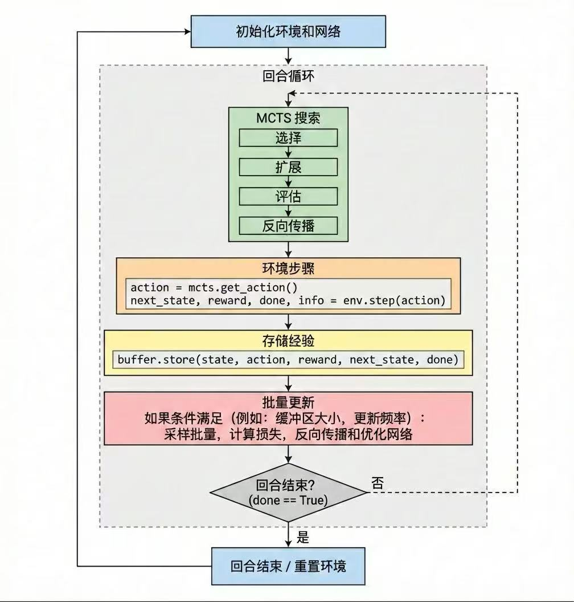

# Dual Network with Monte Carlo Tree Search for Multi-Agent Autonomous Driving

## 核心算法

### 1. 双网络架构 (Dual Network)

本项目采用 **AlphaZero** 风格的策略-价值联合网络（Policy-Value Network），同时输出动作的概率分布和状态的价值估计。

#### 网络骨干 (Backbone)
支持多种时序编码方案以处理多帧观测 $o_{1:t}$：
- **LSTM (Recurrent)**：利用隐藏状态 $h_t$ 传递长程记忆。
- **TCN (Temporal Convolutional)**：利用膨胀因果卷积并行处理历史窗口。本项目采用**非均匀采样**（索引 $[t, t-1, t-3, t-7, t-15]$）与**差分特征增强**（拼接 $o_t - o_{t-k}$），在 $T=5$ 的输入下实现 $16$ 帧的感受野。

#### 连续动作头 (Continuous Action Heads)
与原版 AlphaGo 处理离散动作不同，本项目面向连续控制空间：
- **策略头**：输出高斯分布的均值 $\mu_t = \tanh(f_{\mu}(x_t))$ 与标准差 $\sigma_t = \exp(\text{clamp}(f_{\sigma}(x_t), -5, 1))$。
- **价值头**：输出状态价值估计 $V_t = f_v(x_t)$。

### 2. 蒙特卡洛树搜索 (MCTS)

利用神经网络作为启发式函数进行在线规划。搜索包含 Selection, Expansion, Simulation (Rollout), Backup 四个阶段。

#### UCB 公式与节点属性
每个节点存储访问次数 $N(s, a)$、动作价值 $Q(s, a)$ 和策略先验 $P(s, a)$。选择动作的 UCB 分数为：
\[
U(s, a) = Q(s, a) + c_{puct} \cdot P(s, a) \cdot \frac{\sqrt{\sum_b N(s, b)}}{1 + N(s, a)}
\]

#### 核心优化与对齐
- **强制 Backup 机制**：确保每次模拟（Simulation）无论是否提前终止（如碰撞），都执行一次完整的回传，保证根节点访问次数 $N(s)$ 严格等于模拟次数。
- **确定性 Rollout**：在搜索过程中（$t>0$），受控智能体采用策略网络的均值动作，以降低搜索方差。
- **性能架构**：C++ 后端实现 + TorchScript 推理 + 共享内存 (SHM) 通信，支持大规模多智能体并行搜索。

### 3. 训练与损失函数 (AlphaZero 风格)

#### 训练流程
1. **数据生成**：智能体通过 MCTS 进行自博弈，记录每步的访问分布 $\pi_{mcts}$ 和搜索价值 $v_{mcts}$。
2. **回报归一化 (EMA Normalization)**：采用滑动平均（EMA）维护 Returns 的均值与方差，对 Monte-Carlo 回报进行动态缩放，以稳定价值网络（Value Network）的训练。
3. **TBPTT 训练**：利用截断反向传播处理时序序列，将长轨迹分块进行梯度更新。

#### 探索与退火机制
- **温度退火 (Temperature Schedule)**：在自博弈过程中，MCTS 动作选择的温度 $\tau$ 随 Episode 递减（从 $1.0$ 衰减至 $0.1$），初期鼓励全局探索，后期聚焦于最优决策。
- **Dirichlet 噪声衰减**：根节点加入的 $\text{Dirichlet}(\alpha)$ 噪声比例 $\epsilon$ 同步衰减，确保模型在训练后期能够稳定收敛到高置信度策略。


#### 损失函数公式
通过最小化网络输出与 MCTS 搜索结果之间的差异来更新参数 $\theta$：

**策略损失 (Weighted Gaussian NLL)**：
\[
\mathcal{L}_{policy} = -\sum_{k=1}^{K} \pi_{mcts}(a_k|s) \cdot \log p_{\theta}(a_k|s)
\]
其中 $\pi_{mcts}(a_k|s) = \frac{N(s, a_k)}{\sum N(s, a)}$ 为 MCTS 搜索得到的概率分布，$p_{\theta}$ 为网络输出的高斯密度。

**价值损失 (MSE)**：
\[
\mathcal{L}_{value} = (V_{\theta}(s) - z)^2
\]
其中 $z$ 为目标回报（混合 Monte-Carlo 回报与搜索价值估计）。

**总损失**：
\[
\mathcal{L}_{total} = c_v \cdot \mathcal{L}_{value} + c_p \cdot \mathcal{L}_{policy} + c_{reg} \cdot \|\theta\|^2
\]

#### 训练流程



### 4. 多智能体设置

#### 并行 MCTS

对于 $N$ 个智能体，每个智能体独立运行 MCTS 搜索：

- **并行执行**：使用进程池并行执行多个智能体的 MCTS 搜索
- **共享网络**：所有智能体共享同一个双网络（同质策略）
- **独立搜索**：每个智能体在自己的环境中进行 MCTS 搜索

#### 团队奖励（可选）

支持团队奖励混合：

$$
r_i^{\text{mixed}} = (1 - \alpha) \cdot r_i + \alpha \cdot \bar{r}
$$

其中：
- $r_i$: 智能体 $i$ 的个体奖励
- $\bar{r}$: 团队平均奖励
- $\alpha$: 混合系数（默认 0.2）

## 网络设计细节

### 1. 初始化策略

**权重初始化：**
- 全连接层：正交初始化（Orthogonal Initialization），增益 $\sqrt{2}$
- LSTM：Xavier 初始化（输入门），正交初始化（隐藏门）
- 遗忘门偏置：初始化为 1，有助于梯度流动

**标准差初始化：**
- `log_std` 偏置初始化为 0.5，确保初始探索充分
- 初始标准差 $\sigma_0 \approx 0.97$（通过 `exp(0.5)` 计算）

### 2. 归一化

**Layer Normalization：**
- 在 LSTM 输出后应用 LayerNorm，稳定训练
- 在每个共享全连接层后应用 LayerNorm

### 3. 激活函数

- **ReLU**：用于隐藏层
- **Tanh**：用于策略均值输出（限制在 $[-1, 1]$）
- **Softplus（clamped）**：用于标准差输出（确保正值）


## 代码结构

```
MCTS_DUAL/
├── dual_net.py          # 双网络实现
├── mcts.py              # MCTS 搜索接口
├── train.py             # 训练脚本
├── env.py               # 环境封装
├── utils.py             # 工具函数
└── cpp/                 # C++ 后端实现
    ├── mcts_search.cpp  # MCTS 搜索实现
    ├── ScenarioEnv.cpp  # 环境实现
    └── ...
```

## 观测空间 (Observation Space)

当前交叉路口环境的默认观测维度为 `135`，由以下部分组成（按拼接顺序）：

- **自车基础状态与导航 (obs[0..5])**
  - `x, y, v, heading`（归一化）
  - 到前视导航点（lookahead target）的距离 `d_dst`
  - 指向前视导航点的航向误差 `theta_error`

- **道路/标线显式约束特征 (obs[6..13])**
  - 左/右侧向出界距离采样（近似 road-edge margin）
  - 车身角点出界占比（`geom.is_on_road`）
  - 车身角点压黄线占比（`line_mask.is_line`）
  - 相对参考路径点的偏移量（近似 lateral offset）
  - 其余维度为预留位（当前为 0）

- **邻车相对信息 (obs[14..38])**
  - 最近 `5` 辆邻车，每辆 `5` 维：`dx, dy, dv, dtheta, intent`

- **全周 Lidar 距离射线 (obs[39..134])**
  - `96` 条射线的归一化距离读数

注意：观测维度变更后，训练网络的输入层维度也需要同步调整为 `135`。

## 使用方法

### 构建 C++ 后端（推荐：Release + LTO）

```bash
cd DriveSimX/core/cpp/build
cmake -DCMAKE_BUILD_TYPE=Release ..
make -j$(nproc)
git remote set-url origin git@github.com:ShamG1/ALGORITHM.git
ssh -T git@github.com
```

### 训练

```bash
python MCTS_DUAL/train.py \
    --num-agents 6 \
    --num-lanes 3 \
    --max-episodes 100000 \
    --mcts-simulations 50 \
    --rollout-depth 3 \
    --device cuda \
    --save-dir MCTS_DUAL/checkpoints
```
## 参考文献

- AlphaZero: Mastering Chess and Shogi by Self-Play with a General Reinforcement Learning Algorithm
- Mastering the game of Go with deep neural networks and tree search
- Proximal Policy Optimization Algorithms

## 许可证

[待添加]

