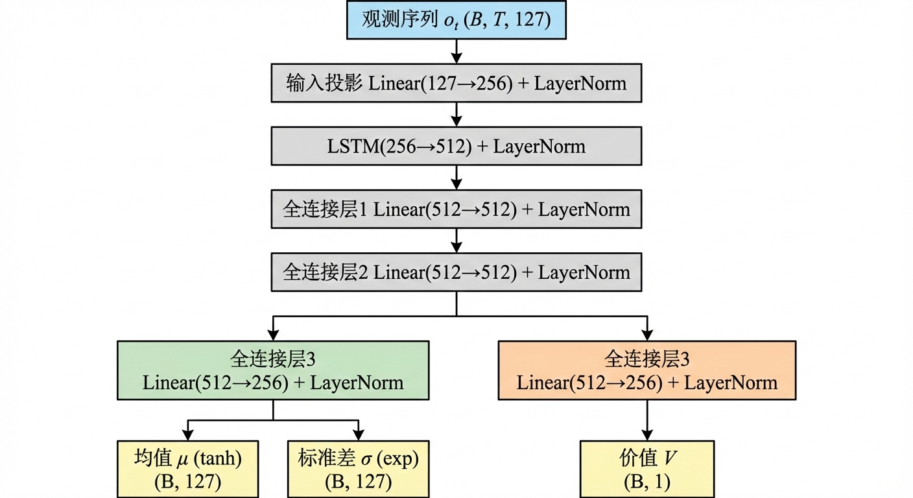
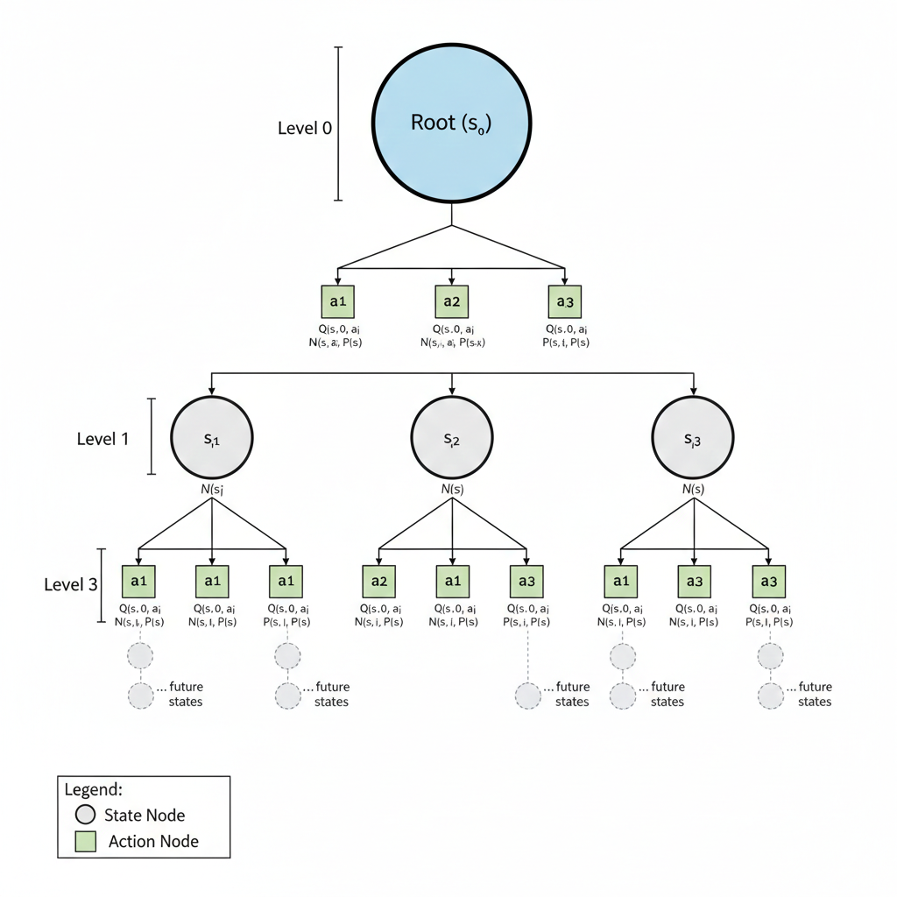

# Dual Network with Monte Carlo Tree Search for Multi-Agent Autonomous Driving

## 核心算法

### 1. 双网络架构 (Dual Network)

双网络采用**共享骨干 + 分离头**的设计，支持多种时序编码骨干（LSTM / TCN / MLP），同时输出策略分布和状态价值估计。

#### 时序编码方案

对于观测序列 $o_{1:t} = \{o_1, o_2, \ldots, o_t\}$，本项目支持以下两种主流编码方式：

##### A. LSTM 编码 (Recurrent)
利用循环神经网络的隐藏状态 $h_t$ 传递记忆：

$h_t = \text{LSTM}(f_{\text{input}}(o_t), h_{t-1})$

$x_t = f_{\text{shared}}(h_t)$

##### B. TCN 编码 (Temporal Convolutional)
利用一维因果卷积 (Causal Conv1d) 并行处理固定窗口历史。对于输入的特征序列 $X \in \mathbb{R}^{C \times T}$：

**因果卷积：**

$y_t = \sum_{i=0}^{k-1} w_i \cdot x_{t-d i}$
其中 $d$ 为膨胀因子 (dilation)，确保 $t$ 时刻的输出仅依赖于 $t$ 及其之前的输入。

**非均匀采样与差分增强：**
为了在不增加计算开销的情况下扩大时序感受野并增强动态感知，本项目在 TCN 模式下引入了以下机制：
- **非均匀采样 (Non-uniform Sampling)**：在 $T=5$ 的窗口内，不再采用连续取帧，而是按照 $[t, t-1, t-3, t-7, t-15]$ 的指数级回溯索引提取历史观测。这使得模型能以极小的输入代价捕捉到长达 16 帧的历史上下文。
- **差分特征拼接 (Delta Features)**：将原始观测 $o_t$ 与其时序差分 $\Delta o_t = o_t - o_{t-k}$ 拼接，输入维度从 $D$ 翻倍至 $2D$。这显式地为模型提供了“加速度”和“变化率”信息，显著提升了在交叉路口避碰等高动态场景下的反应灵敏度。
**残差块结构：**
$\text{Block}(X) = \text{Activation}(\text{CausalConv}(X) + \text{Residual}(X))$

**优势：** TCN 在 MCTS 分支扩展时**不需要拷贝隐藏状态**，仅需维护固定长度的历史缓冲区，推理速度比串行的 LSTM 更快且更容易并行化。最终网络取时序维度最后一刻的特征输出，映射为特征向量 $\mathbf{x}_t$，输入后续的策略与价值头。

#### 策略与价值输出
无论采用哪种编码器，最终的特征向量 $x_t$ 都会通过独立的头部：
- **策略输出：** $\mu_t = \tanh(f_{\mu}(x_t))$, $\sigma_t = \exp(\text{clamp}(f_{\sigma}(x_t), -5, 1))$
- **价值输出：** $V_t = f_v(x_t)$

## 概述

本项目实现了一种结合"双网络（Dual Network）"和"蒙特卡洛树搜索（MCTS）"的强化学习算法，用于多智能体交叉路口导航任务。该算法通过共享 LSTM 骨干网络同时学习策略和价值函数，并利用 MCTS 进行在线规划以提升决策质量。

## 核心算法

### 1. 双网络架构（Dual Network）

双网络采用**共享骨干 + 分离头**的设计，同时输出策略分布和状态价值估计。

#### 网络结构



#### 数学表示


对于观测序列 $o_{1:t} = \{o_1, o_2, \ldots, o_t\}$，网络支持两种主要的共享特征提取模式：

**A. LSTM 模式（Recurrent）：**

$
h_t = \text{LSTM}(f_{\text{input}}(o_t), h_{t-1})
$

$
x_t = f_{\text{shared}}(h_t)
$

**B. TCN 模式（Temporal Convolutional）：**

针对窗口长度为 $K$ 的历史观测，采用**非均匀采样**和**差分增强**处理：

1. **输入构造：** 拼接当前观测与时序差分
   $ \tilde{o}_t = [o_t, o_t - o_{t-k}] $
2. **非均匀采样序列：** 提取指数级回溯的历史特征序列
   $ S_t = \{ \tilde{o}_t, \tilde{o}_{t-1}, \tilde{o}_{t-3}, \tilde{o}_{t-7}, \tilde{o}_{t-15} \} $
3. **特征提取：** 通过多层膨胀因果卷积提取特征
   $ x_t = f_{\text{shared}}(\text{TCN}(S_t)) $

**策略输出：**

$$
\mu_t = \tanh(f_{\mu}(x_t)) \in [-1, 1]
$$

$$
\log \sigma_t = \text{clamp}(f_{\sigma}(x_t), -5, 1)
$$

$$
\sigma_t = \exp(\log \sigma_t)
$$

**价值输出：**

$$
V_t = f_v(x_t)
$$

其中：
- $f_{\text{input}}$: 输入投影层
- $f_{\text{shared}}$: 共享全连接层
- $f_{\mu}, f_{\sigma}$: 策略头（均值和标准差）
- $f_v$: 价值头

#### 动作采样

策略分布为多元高斯分布：

$$
a_t \sim \mathcal{N}(\mu_t, \sigma_t^2)
$$

动作被裁剪到 $[-1, 1]$ 范围内：

$$
a_t = \text{clip}(a_t, -1, 1)
$$

### 2. 蒙特卡洛树搜索（MCTS）

MCTS 利用双网络进行在线规划，通过模拟搜索找到最优动作。

#### MCTS 搜索流程

MCTS 搜索包含四个阶段，重复执行 $N$ 次模拟：


**搜索树结构：**



每个节点存储：
- $N(s)$: 节点访问次数
- $N(s, a)$: 动作访问次数
- $Q(s, a)$: 动作价值估计
- $P(s, a)$: 策略先验概率

#### UCB 公式

对于节点 $s$，选择动作 $a$ 的 UCB 分数为：

$$
U(s, a) = Q(s, a) + c_{\text{puct}} \cdot P(s, a) \cdot \frac{\sqrt{N(s)}}{1 + N(s, a)}
$$

其中：
- $Q(s, a)$: 动作价值估计
- $P(s, a)$: 策略网络给出的先验概率
- $N(s)$: 节点访问次数
- $N(s, a)$: 动作访问次数
- $c_{\text{puct}}$: 探索常数（默认 1.0）

#### 动作采样策略

在 MCTS 搜索完成后，根据访问次数分布采样动作：

$$
P(a|s) = \frac{N(s, a)^{1/\tau}}{\sum_{a'} N(s, a')^{1/\tau}}
$$

其中 $\tau$ 是温度参数：
- $\tau = 1$: 按访问次数分布采样
- $\tau \to 0$: 贪婪选择访问次数最多的动作

### 3. 训练方法

#### 经验回放与 TBPTT

使用截断反向传播（Truncated Backpropagation Through Time, TBPTT）训练 LSTM 网络：

1. **经验收集**：在环境中执行 MCTS 选择的动作，收集轨迹
2. **批量更新**：当缓冲区达到阈值（64 步）时进行批量更新
3. **序列分块**：将长序列分成固定长度（16 步）的块进行 TBPTT

#### 损失函数

**策略损失（Policy Loss）：**

$$
\mathcal{L}_{\text{policy}} = -\mathbb{E}_t[\log \pi(a_t|o_t) \cdot \hat{A}_t]
$$

其中 $\hat{A}_t$ 是归一化后的优势函数：

$$
A_t = R_t - V(o_t)
$$

$$
\hat{A}_t = \frac{A_t - \bar{A}}{\sigma_A + \epsilon}
$$

其中：
- $R_t$: 回报（Returns）
- $V(o_t)$: 价值网络估计
- $\bar{A}$: 优势函数的均值
- $\sigma_A$: 优势函数的标准差
- $\epsilon = 10^{-8}$: 防止除零的小常数

归一化优势函数有助于稳定训练，减少方差。

**价值损失（Value Loss）：**

$$
\mathcal{L}_{\text{value}} = \mathbb{E}_t[(V(o_t) - R_t)^2]
$$

**总损失：**

$$
\mathcal{L}_{\text{total}} = \mathcal{L}_{\text{value}} + \lambda_p \cdot \mathcal{L}_{\text{policy}}
$$

其中 $\lambda_p = 0.5$ 是策略损失权重。

**回报计算（Returns）：**

$$
R_t = r_t + \gamma R_{t+1} \cdot (1 - d_t)
$$

其中：
- $r_t$: 即时奖励
- $\gamma = 0.99$: 折扣因子
- $d_t$: 终止标志

#### 训练流程


### 4. 多智能体设置

#### 并行 MCTS

对于 $N$ 个智能体，每个智能体独立运行 MCTS 搜索：

- **并行执行**：使用进程池并行执行多个智能体的 MCTS 搜索
- **共享网络**：所有智能体共享同一个双网络（同质策略）
- **独立搜索**：每个智能体在自己的环境中进行 MCTS 搜索

#### 团队奖励（可选）

支持团队奖励混合：

$$
r_i^{\text{mixed}} = (1 - \alpha) \cdot r_i + \alpha \cdot \bar{r}
$$

其中：
- $r_i$: 智能体 $i$ 的个体奖励
- $\bar{r}$: 团队平均奖励
- $\alpha$: 混合系数（默认 0.2）

## 网络设计细节

### 1. 初始化策略

**权重初始化：**
- 全连接层：正交初始化（Orthogonal Initialization），增益 $\sqrt{2}$
- LSTM：Xavier 初始化（输入门），正交初始化（隐藏门）
- 遗忘门偏置：初始化为 1，有助于梯度流动

**标准差初始化：**
- `log_std` 偏置初始化为 0.5，确保初始探索充分
- 初始标准差 $\sigma_0 \approx 0.97$（通过 `exp(0.5)` 计算）

### 2. 归一化

**Layer Normalization：**
- 在 LSTM 输出后应用 LayerNorm，稳定训练
- 在每个共享全连接层后应用 LayerNorm

### 3. 激活函数

- **ReLU**：用于隐藏层
- **Tanh**：用于策略均值输出（限制在 $[-1, 1]$）
- **Softplus（clamped）**：用于标准差输出（确保正值）


## 代码结构

```
MCTS_DUAL/
├── dual_net.py          # 双网络实现
├── mcts.py              # MCTS 搜索接口
├── train.py             # 训练脚本
├── env.py               # 环境封装
├── utils.py             # 工具函数
└── cpp/                 # C++ 后端实现
    ├── mcts_search.cpp  # MCTS 搜索实现
    ├── IntersectionEnv.cpp  # 环境实现
    └── ...
```

## 观测空间 (Observation Space)

当前交叉路口环境的默认观测维度为 `135`，由以下部分组成（按拼接顺序）：

- **自车基础状态与导航 (obs[0..5])**
  - `x, y, v, heading`（归一化）
  - 到前视导航点（lookahead target）的距离 `d_dst`
  - 指向前视导航点的航向误差 `theta_error`

- **道路/标线显式约束特征 (obs[6..13])**
  - 左/右侧向出界距离采样（近似 road-edge margin）
  - 车身角点出界占比（`geom.is_on_road`）
  - 车身角点压黄线占比（`line_mask.is_line`）
  - 相对参考路径点的偏移量（近似 lateral offset）
  - 其余维度为预留位（当前为 0）

- **邻车相对信息 (obs[14..38])**
  - 最近 `5` 辆邻车，每辆 `5` 维：`dx, dy, dv, dtheta, intent`

- **全周 Lidar 距离射线 (obs[39..134])**
  - `96` 条射线的归一化距离读数

注意：观测维度变更后，训练网络的输入层维度也需要同步调整为 `135`。

## 使用方法

### 构建 C++ 后端（推荐：Release + LTO）

```bash
cd envs/intersection/cpp
mkdir build && cd build
cmake -DCMAKE_BUILD_TYPE=Release ..
make -j$(nproc)
```

### 训练

```bash
python MCTS_DUAL/train.py \
    --num-agents 6 \
    --num-lanes 3 \
    --max-episodes 100000 \
    --mcts-simulations 50 \
    --rollout-depth 3 \
    --device cuda \
    --save-dir MCTS_DUAL/checkpoints
```
## 参考文献

- AlphaZero: Mastering Chess and Shogi by Self-Play with a General Reinforcement Learning Algorithm
- Mastering the game of Go with deep neural networks and tree search
- Proximal Policy Optimization Algorithms

## 许可证

[待添加]

