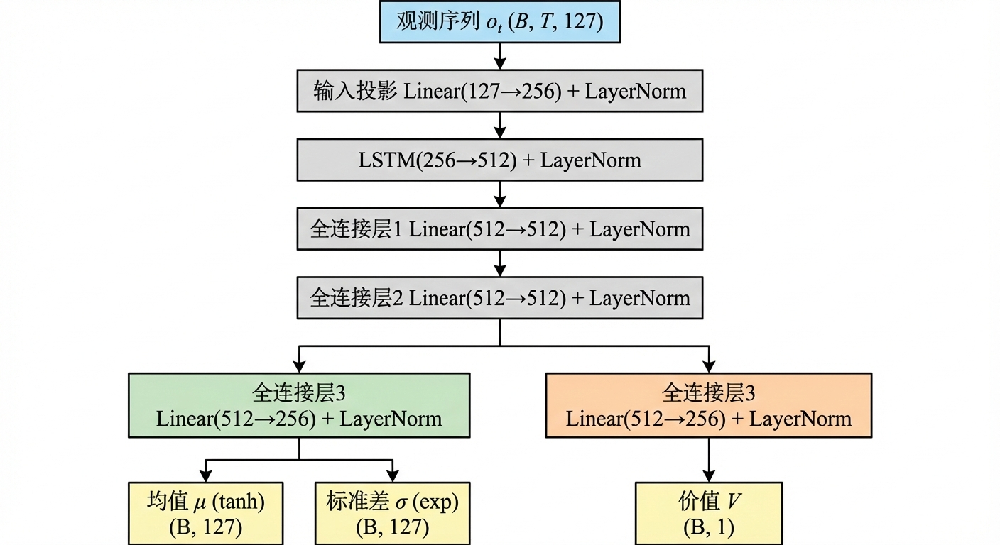
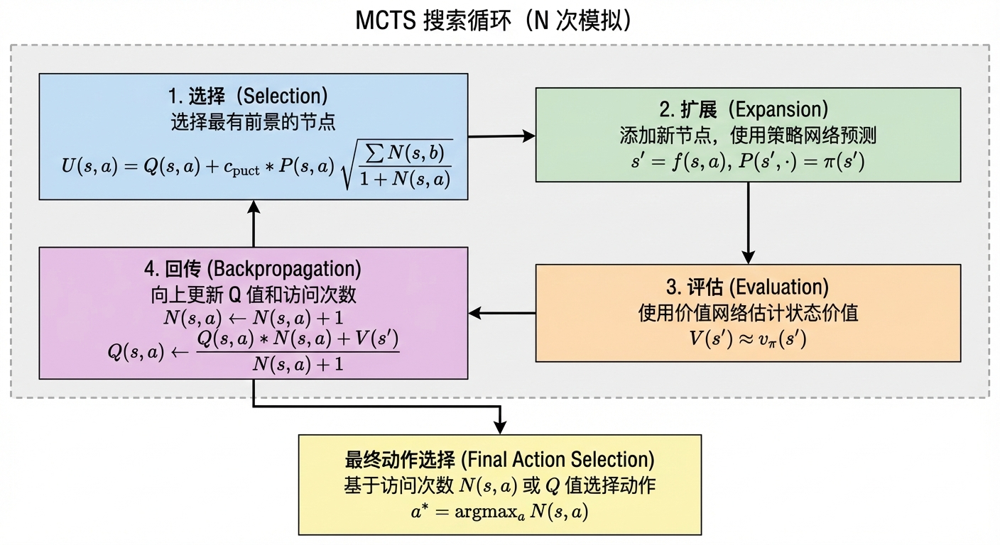
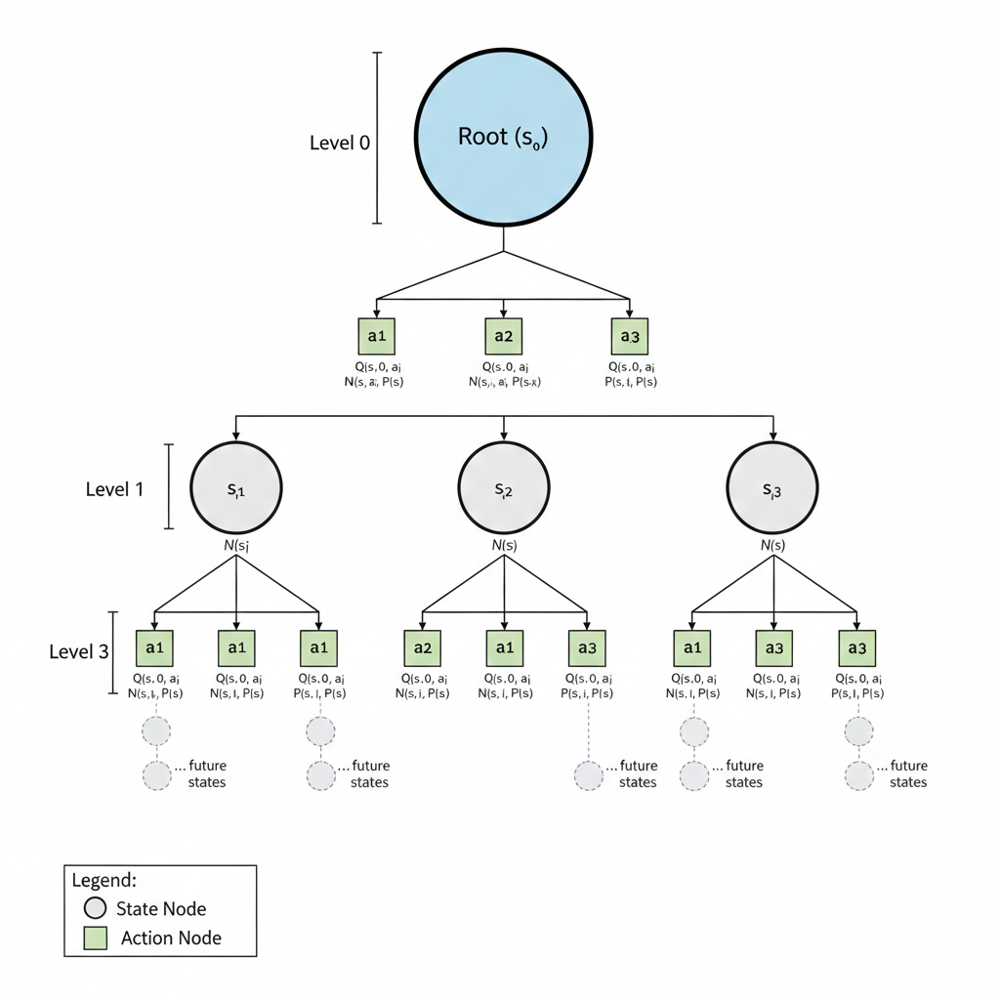
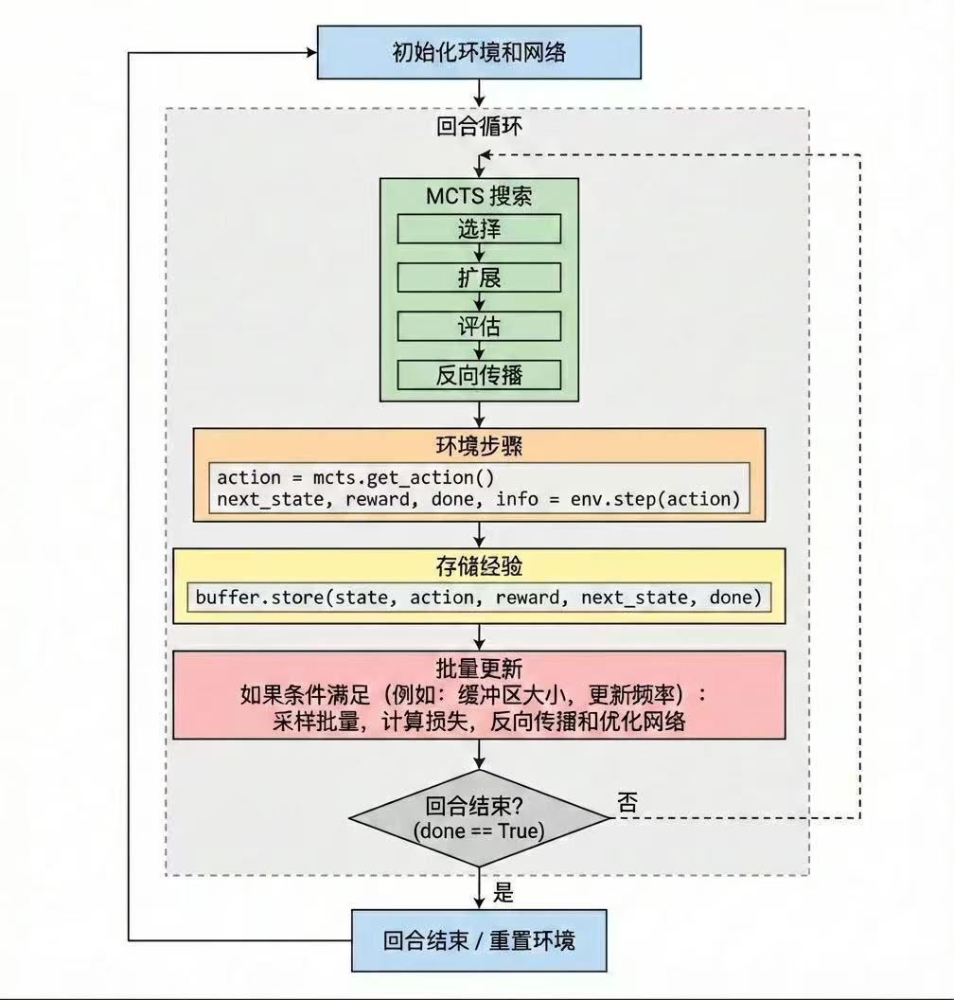

# Dual Network with Monte Carlo Tree Search for Multi-Agent Autonomous Driving

## 概述

本项目实现了一种结合"双网络（Dual Network）"和"蒙特卡洛树搜索（MCTS）"的强化学习算法，用于多智能体交叉路口导航任务。该算法通过共享 LSTM 骨干网络同时学习策略和价值函数，并利用 MCTS 进行在线规划以提升决策质量。

## 核心算法

### 1. 双网络架构（Dual Network）

双网络采用**共享骨干 + 分离头**的设计，同时输出策略分布和状态价值估计。

#### 网络结构



#### 数学表示

对于观测序列 $o_{1:t} = \{o_1, o_2, \ldots, o_t\}$，网络前向传播为：

**共享特征提取：**

$$
h_t = \text{LSTM}(f_{\text{input}}(o_t), h_{t-1})
$$

$$
x_t = f_{\text{shared}}(h_t)
$$

**策略输出：**

$$
\mu_t = \tanh(f_{\mu}(x_t)) \in [-1, 1]
$$

$$
\log \sigma_t = \text{clamp}(f_{\sigma}(x_t), -5, 1)
$$

$$
\sigma_t = \exp(\log \sigma_t)
$$

**价值输出：**

$$
V_t = f_v(x_t)
$$

其中：
- $f_{\text{input}}$: 输入投影层
- $f_{\text{shared}}$: 共享全连接层
- $f_{\mu}, f_{\sigma}$: 策略头（均值和标准差）
- $f_v$: 价值头

#### 动作采样

策略分布为多元高斯分布：

$$
a_t \sim \mathcal{N}(\mu_t, \sigma_t^2)
$$

动作被裁剪到 $[-1, 1]$ 范围内：

$$
a_t = \text{clip}(a_t, -1, 1)
$$

### 2. 蒙特卡洛树搜索（MCTS）

MCTS 利用双网络进行在线规划，通过模拟搜索找到最优动作。

#### MCTS 搜索流程

MCTS 搜索包含四个阶段，重复执行 $N$ 次模拟：



**搜索树结构：**



每个节点存储：
- $N(s)$: 节点访问次数
- $N(s, a)$: 动作访问次数
- $Q(s, a)$: 动作价值估计
- $P(s, a)$: 策略先验概率

#### UCB 公式

对于节点 $s$，选择动作 $a$ 的 UCB 分数为：

$$
U(s, a) = Q(s, a) + c_{\text{puct}} \cdot P(s, a) \cdot \frac{\sqrt{N(s)}}{1 + N(s, a)}
$$

其中：
- $Q(s, a)$: 动作价值估计
- $P(s, a)$: 策略网络给出的先验概率
- $N(s)$: 节点访问次数
- $N(s, a)$: 动作访问次数
- $c_{\text{puct}}$: 探索常数（默认 1.0）

#### 动作采样策略

在 MCTS 搜索完成后，根据访问次数分布采样动作：

$$
P(a|s) = \frac{N(s, a)^{1/\tau}}{\sum_{a'} N(s, a')^{1/\tau}}
$$

其中 $\tau$ 是温度参数：
- $\tau = 1$: 按访问次数分布采样
- $\tau \to 0$: 贪婪选择访问次数最多的动作

### 3. 训练方法

#### 经验回放与 TBPTT

使用截断反向传播（Truncated Backpropagation Through Time, TBPTT）训练 LSTM 网络：

1. **经验收集**：在环境中执行 MCTS 选择的动作，收集轨迹
2. **批量更新**：当缓冲区达到阈值（64 步）时进行批量更新
3. **序列分块**：将长序列分成固定长度（16 步）的块进行 TBPTT

#### 损失函数

**策略损失（Policy Loss）：**

$$
\mathcal{L}_{\text{policy}} = -\mathbb{E}_t[\log \pi(a_t|o_t) \cdot \hat{A}_t]
$$

其中 $\hat{A}_t$ 是归一化后的优势函数：

$$
A_t = R_t - V(o_t)
$$

$$
\hat{A}_t = \frac{A_t - \bar{A}}{\sigma_A + \epsilon}
$$

其中：
- $R_t$: 回报（Returns）
- $V(o_t)$: 价值网络估计
- $\bar{A}$: 优势函数的均值
- $\sigma_A$: 优势函数的标准差
- $\epsilon = 10^{-8}$: 防止除零的小常数

归一化优势函数有助于稳定训练，减少方差。

**价值损失（Value Loss）：**

$$
\mathcal{L}_{\text{value}} = \mathbb{E}_t[(V(o_t) - R_t)^2]
$$

**总损失：**

$$
\mathcal{L}_{\text{total}} = \mathcal{L}_{\text{value}} + \lambda_p \cdot \mathcal{L}_{\text{policy}}
$$

其中 $\lambda_p = 0.5$ 是策略损失权重。

**回报计算（Returns）：**

$$
R_t = r_t + \gamma R_{t+1} \cdot (1 - d_t)
$$

其中：
- $r_t$: 即时奖励
- $\gamma = 0.99$: 折扣因子
- $d_t$: 终止标志

#### 训练流程



### 4. 多智能体设置

#### 并行 MCTS

对于 $N$ 个智能体，每个智能体独立运行 MCTS 搜索：

- **并行执行**：使用进程池并行执行多个智能体的 MCTS 搜索
- **共享网络**：所有智能体共享同一个双网络（同质策略）
- **独立搜索**：每个智能体在自己的环境中进行 MCTS 搜索

#### 团队奖励（可选）

支持团队奖励混合：

$$
r_i^{\text{mixed}} = (1 - \alpha) \cdot r_i + \alpha \cdot \bar{r}
$$

其中：
- $r_i$: 智能体 $i$ 的个体奖励
- $\bar{r}$: 团队平均奖励
- $\alpha$: 混合系数（默认 0.2）

## 网络设计细节

### 1. 初始化策略

**权重初始化：**
- 全连接层：正交初始化（Orthogonal Initialization），增益 $\sqrt{2}$
- LSTM：Xavier 初始化（输入门），正交初始化（隐藏门）
- 遗忘门偏置：初始化为 1，有助于梯度流动

**标准差初始化：**
- `log_std` 偏置初始化为 0.5，确保初始探索充分
- 初始标准差 $\sigma_0 \approx 0.97$（通过 `exp(0.5)` 计算）

### 2. 归一化

**Layer Normalization：**
- 在 LSTM 输出后应用 LayerNorm，稳定训练
- 在每个共享全连接层后应用 LayerNorm

### 3. 激活函数

- **ReLU**：用于隐藏层
- **Tanh**：用于策略均值输出（限制在 $[-1, 1]$）
- **Softplus（clamped）**：用于标准差输出（确保正值）


## 代码结构

```
MCTS_DUAL/
├── dual_net.py          # 双网络实现
├── mcts.py              # MCTS 搜索接口
├── train.py             # 训练脚本
├── env.py               # 环境封装
├── utils.py             # 工具函数
└── cpp/                 # C++ 后端实现
    ├── mcts_search.cpp  # MCTS 搜索实现
    ├── IntersectionEnv.cpp  # 环境实现
    └── ...
```

## 使用方法

### 构建 C++ 后端（推荐：Release + LTO）

```bash
cmake -S MCTS_DUAL/cpp -B MCTS_DUAL/cpp/build -DCMAKE_BUILD_TYPE=Release -DCMAKE_INTERPROCEDURAL_OPTIMIZATION=ON
cmake --build MCTS_DUAL/cpp/build -j
```

### 训练

```bash
python MCTS_DUAL/train.py \
    --num-agents 6 \
    --num-lanes 3 \
    --max-episodes 100000 \
    --mcts-simulations 50 \
    --rollout-depth 3 \
    --device cuda \
    --save-dir MCTS_DUAL/checkpoints
```
## 参考文献

- AlphaZero: Mastering Chess and Shogi by Self-Play with a General Reinforcement Learning Algorithm
- Mastering the game of Go with deep neural networks and tree search
- Proximal Policy Optimization Algorithms

## 许可证

[待添加]

